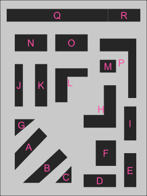

<!-- README.md is generated from README.Rmd. Please edit that file -->

# gardenR 

The `gardenR` package contains data collected by Lisa Lendway from her
vegetable garden, starting in the summer of 2020. Data from the summer
of 2021 was added 2022-01-29 (finally!). The data were used in her
Introduction to Data Science course at Macalester College to introduce
many concepts. For examples, see the [tutorials for the
course](https://ds112-lendway.netlify.app/).

If you’d like a visual tour of the garden, check out this [YouTube
video](https://www.youtube.com/embed/iGMgLFIiSxo).

## Installation

You can install the development version from
[GitHub](https://github.com/) with:

``` r
# install.packages("devtools")
devtools::install_github("llendway/gardenR")
```

## Datasets

`garden_coords`: This dataset gives coordinates for the vertices of the
plots in the garden.

### 2020 (first year I collected data)

`garden_harvest`: Each row is a “harvest” of a particular vegetable
variety. So, each time she harvested a particular vegetable/variety
combination, she weighed the entire harvest. There could be multiple
harvests of a vegetable/variety combination in a single day. There are
two exceptions: all pumpkin and winter squash (vegetable = “squash”)
were weighed individually.

`garden_spending`: summarizes how much was spent on gardening materials.

`garden_planting`: The rows represent the planting of a vegetable
variety. There could be multiple rows for the same vegetable variety, if
they were planted on the same day in different plots or on different
days.

### 2021

`harvest_2021`: Similar to `garden_harvest` but for 2021.

`spending_2021`: Similar to `garden_spending` but for 2021.

`planting_2021`: Similar to `garden_planting` but for 2021.

## Example

Here is a representation of the plots in the garden - like a bird’s eye
view of the garden.

``` r
library(gardenR)
library(tidyverse)

for_labs <- garden_coords %>% 
  group_by(plot) %>% 
  summarize(x = mean(x),
            y = mean(y))

garden_coords %>% 
  ggplot(aes(x = x, y = y, group = plot)) +
  geom_polygon() +
  geom_text(data = for_labs, 
            aes(x = x, y = y, label = plot), 
            color = "hotpink",
            size = 5) +
  theme_void() +
  theme(panel.background = element_rect(fill = "lightgray"))
```



Here is one example plot, using the `garden_harvest` data.

``` r
garden_harvest %>% 
  filter(vegetable == "tomatoes") %>% 
  group_by(date) %>% 
  summarize(daily_wt_g = sum(weight)) %>% 
  ggplot(aes(x = date, y = daily_wt_g)) +
  geom_point(color = "darkred") +
  geom_line(color = "darkred") +
  labs(title = "2020 daily tomato harvest (g)",
       x = "",
       y = "") +
  theme_minimal()
```


